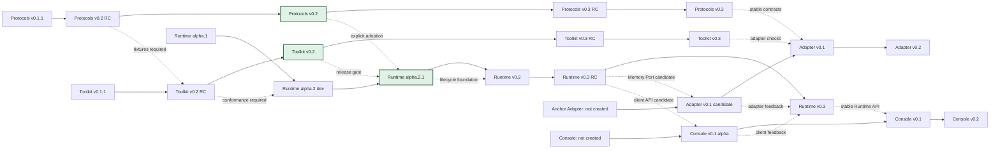

# House Ecosystem Roadmap

This is the canonical version-alignment map for the five planned public repositories. It describes dependency order and release gates, not a promise that unfinished work will ship on a calendar date.

## Version alignment

## Phase table

| Phase | Relative timing | Protocols | Toolkit | Runtime | Anchor Adapter | Console | Exit gate |
| --- | --- | --- | --- | --- | --- | --- | --- |
| T0: released baseline | Completed | `v0.1.1` | `v0.1.1` | `v0.1.0-alpha.1` | Not created | Not created | Historical public-clone and CI baseline passed |
| T1: contract alignment | Completed | `v0.2 RC` | `v0.2 RC` | `alpha.2` development branch | Not created | Not created | v0.1 retention fixtures and v0.2 migration fixtures passed in Toolkit and Runtime |
| T2: controlled Runtime | Current completed release line | `v0.2.0` | `v0.2.0` | `v0.1.0-alpha.2.1` | Design notes only | API observations only | Scheduler, timeout, cancellation, confirmation, Resignature, Memory Port, and restart tests pass |
| T3: 24-hour lifecycle | Next; about 3-6 focused development days | `v0.2.x` | `v0.2.x` | `v0.2` | Local conformance fixture only | Local client fixture only | Fake-clock tests cover sleep, tick, journal, dream, handoff, and delivery feedback loops |
| T4: portability candidates | After T3; about 3-5 focused development days plus second implementations | `v0.3 RC` | `v0.3 RC` | `v0.3 RC` | Local `v0.1` candidate | Local `v0.1 alpha` candidate | Two Memory Adapters and two clients pass conformance without private House dependencies |
| T5: public portability | After T4 gates; release hardening only | `v0.3` | `v0.3` | `v0.3` | Create repository and release `v0.1` | Create repository and release `v0.1 alpha` | Public clone, migration, security, and cross-repository CI pass |

Effort estimates begin only after the previous phase passes. They exclude production House integration and may change when tests expose architectural work.

## Dependency rules

1. Protocols publishes fixtures before Toolkit claims support.
2. Toolkit publishes a conformance profile before Runtime adopts a new protocol version.
3. Runtime adopts versions explicitly through exact tags and lockfile SHAs.
4. Runtime v0.2 must prove lifecycle behavior with a fake clock before real scheduling is enabled.
5. Anchor Adapter and Console repositories are not created until Runtime v0.3 candidate ports have independent implementations to test against.
6. Production House integration is a separate shadow-and-migration project, not an automatic final phase of this public roadmap.
