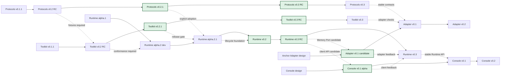

# House Ecosystem Roadmap

This is the canonical version-alignment map for the five planned public repositories. It describes dependency order and release gates, not a promise that unfinished work will ship on a calendar date.

## Version alignment

## Phase table

| Phase | Relative timing | Protocols | Toolkit | Runtime | Anchor Adapter | Console | Exit gate |
| --- | --- | --- | --- | --- | --- | --- | --- |
| T0: released baseline | Completed | `v0.1.1` | `v0.1.1` | `v0.1.0-alpha.1` | Not created | Not created | Historical public-clone and CI baseline passed |
| T1: contract alignment | Completed | `v0.2 RC` | `v0.2 RC` | `alpha.2` development branch | Not created | Not created | v0.1 retention fixtures and v0.2 migration fixtures passed in Toolkit and Runtime |
| T2: controlled Runtime | Completed | `v0.2.0` | `v0.2.0` | `v0.1.0-alpha.2.1` | Design notes only | API observations only | Scheduler, timeout, cancellation, confirmation, Resignature, Memory Port, and restart tests pass |
| T3: 24-hour lifecycle | Completed stable release line | `v0.2.1` | `v0.2.1` | `v0.2.0` | Not created | Not created | Fake-clock tests cover sleep, tick, journal, dream, handoff, restart, and delivery feedback loops |
| T4: portability candidates | Completed release-candidate line | `v0.3.0-rc.1` | `v0.3.0-rc.1` | `v0.3.0-rc.1` | Two standalone local adapters passed | Two Runtime clients passed | Two Memory Adapters, two clients, restart delivery, migration, and cross-repository CI pass without private House dependencies |
| T5: public portability | Current public candidate line; release hardening and second-consumer feedback remain | `v0.3.0-rc.2` | `v0.3.0-rc.3`; supersedes RC2 | `v0.3.0-rc.2` | `v0.1.0-rc.1`; real Anchor upstream integration passes | `v0.1.0-alpha.1`; real Runtime HTTP integration and browser tests pass | Public clone, Anchor compatibility, authenticated client, migration, security, and cross-repository CI pass |

Effort estimates begin only after the previous phase passes. They exclude production House integration and may change when tests expose architectural work.

## Dependency rules

1. Protocols publishes fixtures before Toolkit claims support.
2. Toolkit publishes a conformance profile before Runtime adopts a new protocol version.
3. Runtime adopts versions explicitly through exact tags and lockfile SHAs.
4. Runtime v0.2 must prove lifecycle behavior with a fake clock before real scheduling is enabled.
5. The Runtime v0.3 candidate ports now have independent public implementations. Anchor Adapter and Console release independently and do not inherit stability merely because the ports passed.
6. Production House integration is a separate shadow-and-migration project, not an automatic final phase of this public roadmap.

Toolkit `v0.3.0-rc.2` is superseded by `v0.3.0-rc.3` because RC2 checked Evidence readback against the wrong identifier field. Consumers must use RC3 or later.
